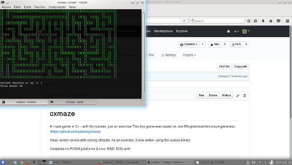

# cxmaze
A maze game in C++ with lib ncurses, just an exercise
This tiny game was based on Joe Wingbermuehle's maze generator (https://github.com/joewing/maze)

It has randon levels with raising dificulty. As an exercise, it was writen using the curses library.


Compiles on POSIX platforms (Linux, BSD, IOS) with:
    
    ```g++ -O2 -o cxmaze cxmaze.cpp -lncurses```
    

